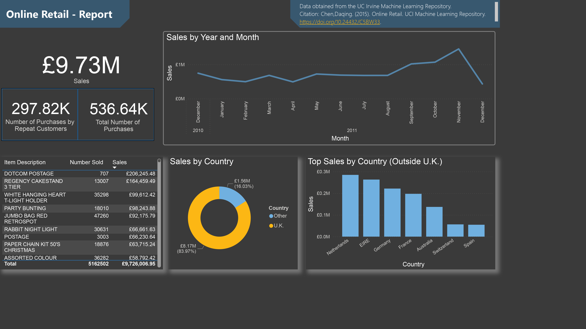

# Online Retail

This report covers sales in 2011 for a UK-based online retailer.

## Insights

1. Sales peaked in November 2011.
2. Most sales are within the U.K.
3. Outside the U.K. the best markets by far are the Netherlands, Ireland, Germany, and France.
4. A majority of transactions are from returning customers *.

   *This calculation only includes customers who had two or more separate transactions in the period from December 2010 to December 2011. It is likely that even more of the total transactions were actually from repeat customers.

## Data Source

The data for this project was sourced from the UC Irvine Machine Learning Repository.

Citation: Chen,Daqing. (2015). Online Retail. UCI Machine Learning Repository. https://doi.org/10.24432/C5BW33.
