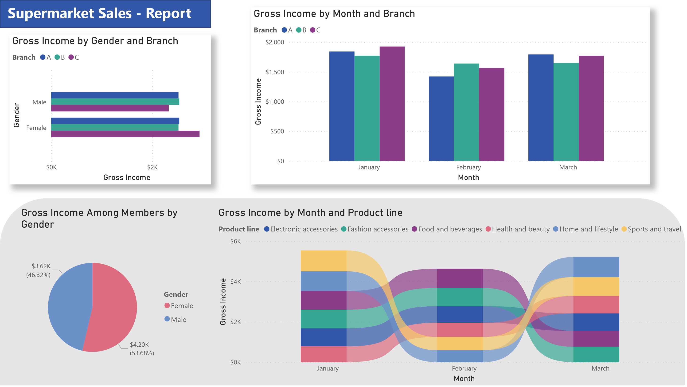

# Supermarket Sales

This report covers sales for a chain of supermarkets in Myanmar, covering three locations, from January to March of 2019.

## Insights

1. Branch C was the best performing.
2. Women accounted for the majority of income (both total and among members) and were far more likely to spend at branch C than either of the other two branches.
3. Health and Beauty items accounted for a greater amount of the gross income month over month.

## Data Source

The data for this project is available on Kaggle courtesy of Aung Pyae through the following link:

https://www.kaggle.com/datasets/aungpyaeap/supermarket-sales
